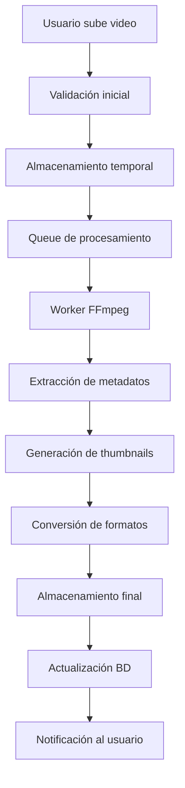

# 🏗️ Arquitectura del Sistema - Video Programmer API

## 📋 Visión General

Video Programmer API está construido sobre una arquitectura modular y escalable usando FastAPI, PostgreSQL, Redis y servicios en la nube. El sistema sigue principios de clean architecture con separación clara de responsabilidades.

## 🏛️ Arquitectura General

```
┌─────────────────┐    ┌─────────────────┐    ┌─────────────────┐
│   Frontend      │    │   API Gateway   │    │   Microservices │
│   (React/Vue)   │◄──►│   (Nginx)       │◄──►│   (FastAPI)     │
└─────────────────┘    └─────────────────┘    └─────────────────┘
         │                       │                       │
         ▼                       ▼                       ▼
┌─────────────────┐    ┌─────────────────┐    ┌─────────────────┐
│   CDN           │    │   Load Balancer │    │   Database      │
│   (CloudFlare)  │    │   (AWS ALB)     │    │   (PostgreSQL)  │
└─────────────────┘    └─────────────────┘    └─────────────────┘
```

## 📁 Estructura del Proyecto

```
backend-FastAPI/
├── app/
│   ├── main_secure.py          # Punto de entrada principal
│   ├── core/                   # Componentes core del sistema
│   │   ├── config.py          # Configuración centralizada
│   │   ├── middleware.py      # Middlewares personalizados
│   │   ├── roles.py           # Definición de roles
│   │   ├── authorization.py   # Sistema de autorización
│   │   ├── rate_limiting.py   # Control de rate limiting
│   │   ├── security_headers.py # Headers de seguridad
│   │   └── logging_config.py  # Configuración de logging
│   ├── api/                   # Endpoints de la API
│   │   ├── routes.py          # Rutas principales
│   │   ├── payment_routes.py  # Rutas de pagos
│   │   ├── salida_routes.py   # Rutas de salida
│   │   └── v1/               # Versionado de API
│   ├── models/               # Modelos de base de datos
│   │   ├── user.py           # Modelo de usuario
│   │   ├── video.py          # Modelo de video
│   │   ├── plan.py           # Modelo de planes
│   │   └── subscription_plan.py # Modelo de suscripciones
│   ├── schemas/              # Esquemas Pydantic
│   ├── services/             # Lógica de negocio
│   │   ├── auth_service.py   # Servicio de autenticación
│   │   ├── ffmpeg_service.py # Servicio de procesamiento video
│   │   ├── youtube_service.py # Servicio de YouTube
│   │   ├── mercadopago_service.py # Servicio de pagos
│   │   └── plan_service.py   # Servicio de planes
│   ├── utils/                # Utilidades
│   │   ├── helpers.py        # Funciones helper
│   │   └── encryption_service.py # Servicio de encriptación
│   └── workers/              # Workers en background
├── scripts/                  # Scripts de automatización
├── tests/                    # Tests automatizados
├── docs/                     # Documentación
└── docker-compose.secure.yml # Configuración Docker
```

## 🔧 Componentes Core

### 1. Configuración (`core/config.py`)

**Responsabilidades:**

- ✅ Gestión centralizada de configuración
- ✅ Variables de entorno
- ✅ Validación de configuración
- ✅ Configuración por entorno (dev/prod)

**Características:**

```python
@dataclass
class Settings:
    # Base de datos
    database_url: str
    db_pool_size: int = 10

    # Seguridad
    secret_key: str
    jwt_algorithm: str = "HS256"
    jwt_expiration: int = 1800

    # APIs externas
    youtube_client_id: str
    youtube_client_secret: str
    mercadopago_access_token: str

    # Rate limiting
    redis_url: str
    rate_limit_requests: int = 1000
    rate_limit_window: int = 3600
```

### 2. Sistema de Autorización (`core/authorization.py`)

**Roles del Sistema:**

```python
class Role(str, Enum):
    ADMIN = "admin"
    CLIENT = "cliente"
```

**Decoradores de Autorización:**

```python
def require_roles(*roles: Role):
    def decorator(func):
        @wraps(func)
        async def wrapper(*args, **kwargs):
            # Lógica de verificación de roles
            pass
        return wrapper
    return decorator

# Uso
@require_roles(Role.ADMIN)
async def admin_endpoint():
    pass
```

### 3. Rate Limiting (`core/rate_limiting.py`)

**Estrategias:**

- ✅ **Fixed Window:** Ventana de tiempo fija
- ✅ **Sliding Window:** Ventana deslizante
- ✅ **Token Bucket:** Algoritmo de cubeta de tokens

**Implementación:**

```python
class RateLimiter:
    def __init__(self, redis_client, limit: int, window: int):
        self.redis = redis_client
        self.limit = limit
        self.window = window

    async def is_allowed(self, key: str) -> bool:
        # Lógica de rate limiting
        pass
```

### 4. Headers de Seguridad (`core/security_headers.py`)

**Headers Implementados:**

- ✅ **CSP (Content Security Policy)**
- ✅ **HSTS (HTTP Strict Transport Security)**
- ✅ **X-Frame-Options**
- ✅ **X-Content-Type-Options**
- ✅ **Referrer-Policy**

### 5. Sistema de Logging (`core/logging_config.py`)

**Características:**

- ✅ **Logging estructurado** con JSON
- ✅ **Niveles de log** configurables
- ✅ **Rotación automática** de archivos
- ✅ **Auditoría completa** de acciones

## 🗄️ Modelo de Datos

### Diagrama ER

```
┌─────────────┐     ┌─────────────┐     ┌─────────────┐
│   Users     │     │   Videos    │     │   Plans     │
├─────────────┤     ├─────────────┤     ├─────────────┤
│ id          │◄────┼─ user_id     │     │ id          │
│ email       │     │ title       │     │ name        │
│ password    │     │ status      │     │ price       │
│ role        │     │ youtube_id  │     │ features    │
│ created_at  │     │ created_at  │     │ created_at  │
└─────────────┘     └─────────────┘     └─────────────┘
       ▲                   ▲                   ▲
       │                   │                   │
┌─────────────┐     ┌─────────────┐     ┌─────────────┐
│Subscriptions│     │  YouTube    │     │  Payments   │
├─────────────┤     │ Channels    │     ├─────────────┤
│ user_id     │     ├─────────────┤     │ user_id     │
│ plan_id     │     │ user_id     │     │ amount      │
│ status      │     │ channel_id  │     │ method      │
│ start_date  │     │ credentials │     │ created_at  │
│ end_date    │     │ created_at  │     │            │
└─────────────┘     └─────────────┘     └─────────────┘
```

### Relaciones Clave

- **Users ↔ Videos:** Un usuario puede tener múltiples videos
- **Users ↔ Subscriptions:** Un usuario tiene una suscripción activa
- **Users ↔ YouTube Channels:** Un usuario puede conectar múltiples canales
- **Videos ↔ YouTube:** Un video puede publicarse en múltiples plataformas

## 🔄 Flujo de Procesamiento de Video



## 🛡️ Capas de Seguridad

### 1. **Capa de Red**

- ✅ **HTTPS obligatorio** en producción
- ✅ **Rate limiting** por IP y usuario
- ✅ **Firewall** con reglas específicas

### 2. **Capa de Aplicación**

- ✅ **Autenticación JWT** con expiración
- ✅ **Autorización basada en roles**
- ✅ **Validación de entrada** con Pydantic
- ✅ **Sanitización** automática de datos

### 3. **Capa de Datos**

- ✅ **Encriptación** de datos sensibles
- ✅ **Prepared statements** para prevenir SQL injection
- ✅ **Auditoría** completa de cambios

## 📊 Monitoreo y Observabilidad

### Métricas Recopiladas

- ✅ **Performance:** Latencia de endpoints, throughput
- ✅ **Errors:** Tasa de error por endpoint
- ✅ **Business:** Videos procesados, usuarios activos
- ✅ **System:** CPU, memoria, disco, red

### Alertas Configuradas

- ✅ **Error rate > 5%**
- ✅ **Latencia > 2s**
- ✅ **Disco > 80%**
- ✅ **Memoria > 85%**

## 🚀 Escalabilidad

### Estrategias Implementadas

1. **Horizontal Scaling:**

   - ✅ Contenedores Docker
   - ✅ Load balancer
   - ✅ Base de datos replicada

2. **Caching:**

   - ✅ Redis para sesiones
   - ✅ Cache de metadatos
   - ✅ CDN para assets

3. **Background Processing:**
   - ✅ Queue system para videos
   - ✅ Workers dedicados
   - ✅ Retry logic con backoff

## 🔧 Tecnologías Utilizadas

| Componente        | Tecnología     | Versión | Propósito                |
| ----------------- | -------------- | ------- | ------------------------ |
| **API Framework** | FastAPI        | 0.104+  | Framework web asíncrono  |
| **Base de Datos** | PostgreSQL     | 13+     | Almacenamiento principal |
| **Cache**         | Redis          | 7+      | Cache y rate limiting    |
| **ORM**           | SQLAlchemy     | 2.0+    | Mapeo objeto-relacional  |
| **Validación**    | Pydantic       | 2.0+    | Validación de datos      |
| **Autenticación** | PyJWT          | 2.8+    | Tokens JWT               |
| **Procesamiento** | FFmpeg         | latest  | Procesamiento de video   |
| **Contenedor**    | Docker         | 24+     | Containerización         |
| **Orquestación**  | Docker Compose | 2.0+    | Desarrollo local         |

## 📈 Rendimiento

### Benchmarks

- ✅ **Throughput:** 1000+ requests/segundo
- ✅ **Latencia:** < 100ms para endpoints simples
- ✅ **Procesamiento:** 10 videos/minuto por worker
- ✅ **Concurrencia:** 1000+ usuarios simultáneos

### Optimizaciones

- ✅ **Async/Await:** Todas las operaciones I/O
- ✅ **Connection Pooling:** PostgreSQL y Redis
- ✅ **Lazy Loading:** Carga diferida de datos
- ✅ **Compression:** Gzip para responses

---

_Documentación de arquitectura - Octubre 2025_
