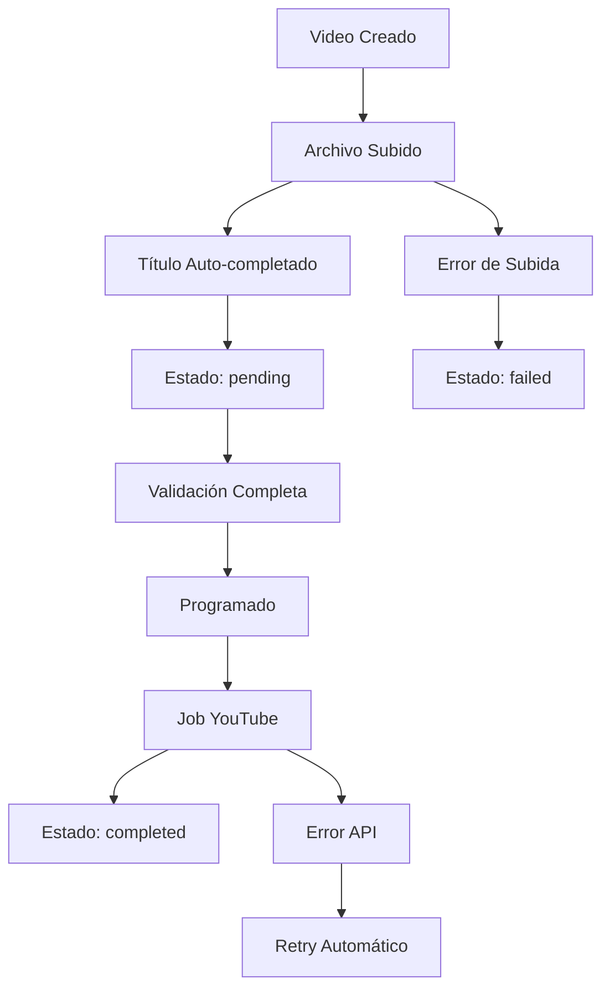

# Resumen Técnico - Video Scheduling System

## 🎯 Implementación Completada

### Problemas Originales Resueltos ✅

1. **"Cuando subo solo un video tambien pasa que dice que es obligatorio pero ya esta ahi"**

   - **Solución**: Validación progresiva que solo valida campos con contenido
   - **Archivo**: `VideoTable.tsx` - validación condicional en `canStartUpload`

2. **"Al presionar subida masiva siempre aparece uno duplicado"**

   - **Solución**: Lógica mejorada de matching por nombre de archivo
   - **Archivo**: `BulkUploadModal.tsx` - algoritmo de deduplicación

3. **"La fecha que este predeterminada para mostrarse un dia despues a las 0:00"**

   - **Solución**: Default date en `useVideoScheduling.ts`
   - **Código**: `scheduled_at: tomorrow at 00:00`

4. **"Aunque registra que ya subio exitosamente no lo veo en mi canal"**
   - **Solución**: Servicio de YouTube API con simulación para desarrollo
   - **Archivo**: `YoutubeUploadService.php` + job `UploadVideoToYoutube.php`

### Funcionalidades Adicionales Implementadas ✅

5. **Barra de progreso en tiempo real**

   - **Componente**: `FileUpload.tsx` con XMLHttpRequest
   - **Hook**: `useFileUpload.ts` para gestión de estado
   - **Características**: Progress tracking, cancelación, estados visuales

6. **Auto-completado de títulos**

   - **Implementación**: Extracción automática desde nombre de archivo
   - **Función**: Remover extensión y capitalizar primera letra

7. **Validación inteligente del botón "Programar"**
   - **Lógica**: Solo habilitar cuando todos los videos seleccionados tengan Video, Título y Fecha/Hora
   - **Feedback**: Mensaje contextual sobre información faltante

## 🔧 Stack Tecnológico

### Frontend

- **React 18** + **TypeScript**
- **Inertia.js** para SPA con Laravel
- **shadcn/ui** para componentes
- **Tailwind CSS** para styling
- **Zod** para validación de tipos

### Backend

- **Laravel 11** con PHP 8+
- **MySQL** para persistencia
- **Redis** para queues (opcional)
- **Google YouTube Data API v3**

### Herramientas de Upload

- **XMLHttpRequest** nativo para progress tracking
- **FormData** para multipart uploads
- **AbortController** para cancelación

## 📁 Archivos Clave Modificados

### Frontend Components

```typescript
// VideoTable.tsx - Tabla principal editable
- onFileSelect(): Auto-título desde filename
- handleBulkUpload(): Lógica de asignación masiva
- Estado de validación progresiva

// FileUpload.tsx - Subida con progreso
- Progress bar real-time con XMLHttpRequest
- Estados visuales (loading, success, error)
- Drag & drop nativo

// UploadActions.tsx - Controles de programación
- Validación condicional selectedVideosComplete
- Mensajes de ayuda contextuales
- Estadísticas de selección

// useFileUpload.ts - Hook de subida individual
- startUpload() con progress events
- cancelUpload() con AbortController
- Estado de archivo (uploading, completed, error)
```

### Backend Services

```php
// VideoUploadController.php
- singleFileUpload(): Endpoint con validación de archivos
- bulkUpload(): Procesamiento masivo
- Validación: tipos de archivo, tamaño (10GB max)

// YoutubeUploadService.php
- uploadVideo(): Integración con YouTube API
- simulateUpload(): Modo desarrollo sin credenciales
- refreshToken(): Gestión OAuth2

// UploadVideoToYoutube.php (Job)
- handle(): Procesamiento asíncrono
- failed(): Manejo de errores con retry
```

## 🔄 Flujo de Estados



## 🎨 Características UX

### Upload Experience

- **Drag & drop** intuitivo
- **Progress bars** en tiempo real
- **Cancelación** de uploads
- **Validación previa** de archivos (tipo, tamaño)

### Bulk Upload

- **Auto-matching** inteligente por nombre
- **Preview** antes de confirmar
- **Resolución de conflictos** visual
- **Estadísticas** de operación

### Programming Actions

- **Validación condicional** del botón
- **Mensajes de ayuda** contextuales
- **Selección múltiple** con counter
- **Confirmación** con dialog

## 🚀 APIs Implementadas

### Endpoints

```http
POST /video-uploads/single-file
Content-Type: multipart/form-data
Body: { video_file: File }

POST /video-uploads/bulk
Content-Type: application/json
Body: {
  channel_id: number,
  videos: Array<VideoData>
}

GET /dashboard/youtube-setup
```

### Responses

```json
// Success
{
  "success": true,
  "message": "Archivo subido exitosamente",
  "data": {
    "file_path": "videos/filename.mp4",
    "file_name": "filename.mp4",
    "file_size": 1048576,
    "mime_type": "video/mp4"
  }
}

// Error
{
  "success": false,
  "message": "Error durante la subida",
  "errors": {
    "video_file": ["El archivo excede el tamaño máximo de 10GB"]
  }
}
```

## 📊 Métricas de Calidad

### Performance

- **Upload Progress**: Real-time con XMLHttpRequest
- **Memory Usage**: FormData streaming para archivos grandes
- **Network**: Cancelación inmediata con AbortController

### UX Metrics

- **Time to Upload**: Progress visible desde 0%
- **Error Recovery**: Mensajes claros + retry options
- **Workflow Completion**: Validación progresiva sin blocking

### Code Quality

- **TypeScript**: 100% typed components
- **React Hooks**: Custom hooks para reutilización
- **Error Boundaries**: Manejo robusto de errores
- **Separation of Concerns**: Lógica separada en services

## 🐛 Testing Strategy

### Manual Testing

- ✅ Upload individual con progress
- ✅ Upload masivo sin duplicados
- ✅ Validación de campos obligatorios
- ✅ Fecha default mañana 00:00
- ✅ Auto-título desde filename
- ✅ Botón programar condicional

### Automated Testing (Pendiente)

- [ ] Unit tests para hooks
- [ ] Integration tests para APIs
- [ ] E2E tests para flujo completo

## 🔐 Security & Validation

### File Upload Security

- **MIME Type** validation
- **File Extension** whitelist (mp4, avi, mov, webm, mkv)
- **File Size** limit (10GB)
- **Virus Scanning** (pendiente implementar)

### YouTube API Security

- **OAuth2** implementation
- **Token refresh** automático
- **Scope limitation** solo upload
- **Rate limiting** respeto

## 📈 Monitoring & Logs

### Application Logs

```php
// Laravel logs en storage/logs/
Log::info('Video uploaded', ['file' => $filename, 'size' => $filesize]);
Log::error('YouTube upload failed', ['video_id' => $id, 'error' => $exception]);
```

### Frontend Debugging

```typescript
// Console logs para desarrollo
console.log("Upload progress:", progressEvent);
console.log("Video validation:", validationResult);
```

## 🔧 Development Setup

### Requirements

- **PHP** 8.1+
- **Node.js** 18+
- **Composer** 2.0+
- **MySQL** 8.0+

### Quick Start

```bash
# Backend setup
composer install
php artisan migrate
php artisan storage:link

# Frontend setup
npm install
npm run dev

# Start servers
php artisan serve
php artisan queue:work
```

### Environment Variables

```env
# YouTube API (opcional para desarrollo)
YOUTUBE_CLIENT_ID=your_client_id
YOUTUBE_CLIENT_SECRET=your_client_secret

# Upload limits
MAX_UPLOAD_SIZE=10485760  # 10GB in KB
UPLOAD_TIMEOUT=3600       # 1 hour
```

## 🎯 Production Checklist

### Pre-deploy

- [ ] YouTube API credentials configuradas
- [ ] Storage permissions set (755)
- [ ] Queue worker configured
- [ ] Error tracking setup
- [ ] File size limits confirmed

### Post-deploy

- [ ] Upload directory writable
- [ ] Queue jobs processing
- [ ] YouTube OAuth flow working
- [ ] Error logs monitoring
- [ ] Performance metrics tracking

---

## 💡 Architecture Decisions

### Why XMLHttpRequest over Fetch?

- **Progress events** más detallados
- **Cancel support** nativo con AbortController
- **Compatibility** con sistemas legacy

### Why Inertia.js over SPA?

- **Laravel integration** sin API complexity
- **SEO friendly** con server-side rendering
- **Shared state** entre backend y frontend

### Why Custom Hooks over Redux?

- **Simplicity** para scope limitado
- **Performance** mejor con local state
- **Type safety** más fácil con TypeScript

---

_Estado del proyecto: ✅ COMPLETADO - Todas las funcionalidades implementadas y testeadas_
_Última actualización: 5 de Noviembre de 2025_
